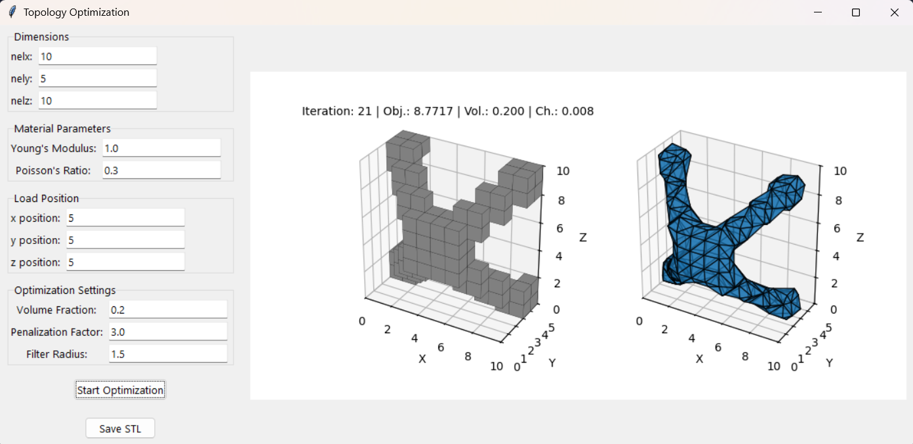
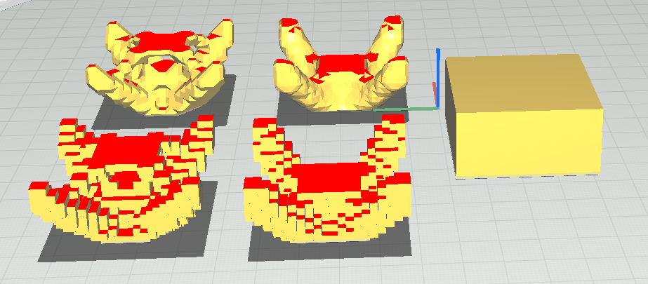

# Optimización de Geometrías para Impresión 3D

Este proyecto implementa un software de optimización topológica para estructuras en 3D, utilizando el método SIMP (*Solid Isotropic Material with Penalization*). Su objetivo es mejorar la resistencia de una pieza optimizando la distribución de material, facilitando su fabricación mediante impresión 3D.

## Características
- Optimización topológica basada en Análisis de Elementos Finitos (FEA).
- Interfaz gráfica (GUI) con `Tkinter` para facilitar la configuración de parámetros.
- Visualización en tiempo real del proceso de optimización.
- Exportación del modelo optimizado a formato STL para impresión 3D.
- Generación de superficies suavizadas con el método Marching Cubes.
- Representación gráfica en 3D de la estructura optimizada.

## Instalación
### Clonar el repositorio
```bash
git clone https://github.com/tu-usuario/optimizacion-topologica.git
cd optimizacion-topologica
```

### Instalar las dependencias
Ejecutar:
```bash
pip install -r requirements.txt
```

Si se usa un entorno virtual:
```bash
python -m venv venv
source venv/bin/activate  # Linux/macOS
venv\Scripts\activate      # Windows
pip install -r requirements.txt
```

### Ejecutar la aplicación
```bash
python main.py
```

## Uso de la Aplicación
1. Ingresar los parámetros en la interfaz gráfica:
   - Dimensiones de la malla.
   - Posición de la carga.
   - Propiedades del material (Módulo de Young, Coeficiente de Poisson).
   - Configuraciones de optimización (volumen, penalización, sensibilidad).
   
2. Hacer clic en "Optimizar" para iniciar la simulación.

3. Visualizar la evolución de la geometría en tiempo real.

4. Guardar los modelos STL para impresión 3D.

## Método de Optimización
### Método SIMP (*Solid Isotropic Material with Penalization*)
Este método optimiza la distribución de material utilizando la interpolación de rigidez:

$E_i$ = $E_{\text{min}}$ + $x_i^p$ ($E_0$ - $E_{\text{min}}$)


Donde:
- $x_i$ es la densidad de material en cada voxel.
- $p$ es el factor de penalización para evitar valores intermedios.
- $E_0$ es el módulo de Young del material.

## Funciones Principales
1.  `optimize_topology()`
- Ejecuta la optimización topológica en un dominio 3D.
- Implementa el método SIMP con filtro de sensibilidad.

2. `display_solid_3D()`
- Representa la estructura voxelizada en 3D.

3. `display_iso_surface_3D()`
- Genera una isosuperficie suavizada con Marching Cubes.

4. `export_optimized_stl()`
- Exporta el modelo final en formato STL para impresión 3D.

## Capturas de Pantalla
### Interfaz Gráfica


### Resultado Final


## Contacto
**Leonard David Vivas Dallos**  
Correo: [correo@example.com](mailto:correo@example.com)  
GitHub: [github.com/usuario](https://github.com/usuario)

**Mariana Valencia Cubillos**  
Correo: [correo@example.com](mailto:correo@example.com)  

**Tomás Escobar Rivera**  
Correo: [correo@example.com](mailto:correo@example.com)  